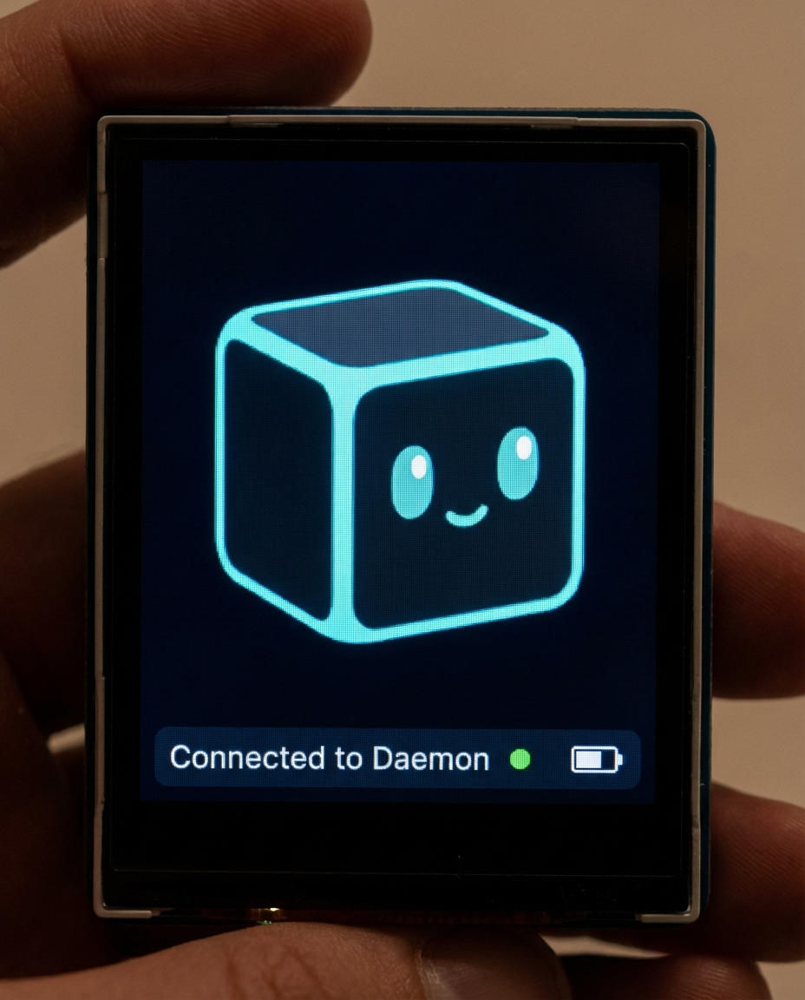

# Voxel

> A pocket AI companion with personality.

Voxel is an animated AI companion that lives on a tiny screen in your pocket. A dark cube mascot with glowing cyan accents, expressive eyes, and a voice — connected to your AI agent team through [OpenClaw](https://github.com/openclaw/openclaw).

Press a button, talk, and Voxel responds — with animated expressions, voice, and the full intelligence of your cloud AI agents behind it.

**Voxel** is the character. The physical device is called the **Relay**.



## Why

Most AI assistants are apps on a phone or text in a terminal. Voxel is something different — a dedicated physical companion with a face, emotions, and presence. It's always there, always listening (when you want it to), and always connected to your AI team.

Think Wall-E meets a modern AI assistant, running on $30 of hardware.

## What It Does

- **Animated character** — expressive cube mascot with eyes, mouth, and body language. 16 mood states across 3 visual styles.
- **Voice interaction** — push-to-talk or wake word ("Hey Voxel"). Whisper for speech-to-text, ElevenLabs for voice.
- **Agent switching** — talk to any agent on your team (Daemon, Soren, Ash, Mira, Jace, Pip) by selecting from the menu.
- **Mouth sync** — mouth animation driven by audio amplitude in real-time via WebSocket.
- **Idle behaviors** — slow blinks, gaze drift, gentle breathing animation. Voxel feels alive even when idle.
- **Live design** — edit expressions and styles in shared YAML, see changes instantly in the browser.

## Hardware (The Relay)

| Component | Details |
|-----------|---------|
| **Brain** | Raspberry Pi Zero 2W |
| **Display** | 1.69" IPS LCD, 240x280px (PiSugar Whisplay HAT) |
| **Audio** | Dual MEMS microphones + mono speaker |
| **Input** | Mouse-style buttons (left/right click) |
| **Feedback** | RGB LED indicator |
| **Power** | PiSugar 3 battery (1200mAh portable) |

Total hardware cost: ~$50-60

## Current Status

| Component | Status |
|-----------|--------|
| React face renderer (Framer Motion) | Done |
| 16 moods, 3 styles (kawaii/retro/minimal) | Done |
| Shared YAML data layer (expressions/styles/moods) | Done |
| Python WebSocket backend (server.py) | Done |
| State machine (7 states) | Done |
| WebSocket frontend hook (useVoxelSocket) | Done |
| Platform abstraction (desktop/Pi) | Done |
| OpenClaw gateway client | Done |
| Dev workflow (backend + frontend HMR) | Done |
| Voice pipeline (STT → OpenClaw → TTS → mouth sync) | Done |
| Conversation chat panel + text input fallback | Done |
| Settings/menu UI + persisted runtime settings | Done |
| Voxel CLI (`voxel doctor`, `voxel setup`, etc.) | Done |
| Pi remote-appliance mode (UI on :8081) | Done |
| WPE/Cog deployment on Pi | In progress - Whisplay hardware verified, direct DRM path failing on current Pi image |
| LVGL native renderer proof of concept | Done |
| WSL -> Pi LVGL render/sync/play loop | Done |
| Wake word detection | Planned |

## Architecture

React frontend + Python WebSocket backend. The React app IS the production UI. On the assembled Relay it runs on the Pi via WPE/Cog (embedded WebKit); before the Whisplay HAT is attached, the same built UI can be served from the Pi and opened in a remote browser.

```
  React UI (app/)              Python Backend (server.py)
  ┌─────────────────┐          ┌──────────────────────────┐
  │ Framer Motion    │◄──ws──►│ State Machine             │
  │ face animation   │  :8080  │ Hardware (buttons/LED/bat)│
  │ mood/style/mouth │         │ AI (OpenClaw, STT, TTS)   │
  └────────┬────────┘          └──────────┬───────────────┘
           │                              │
     shared/*.yaml                   shared/*.yaml
     (expressions, styles, moods)    (moods, expressions)
```

```
voxel/
├── server.py              # Python WebSocket backend
├── app/                   # React production UI
│   ├── src/
│   │   ├── App.jsx        # Main app + dev panel
│   │   ├── components/
│   │   │   └── VoxelCube.jsx  # Animated cube face
│   │   ├── hooks/
│   │   │   └── useVoxelSocket.js  # WebSocket client
│   │   ├── expressions.js # Re-exports from shared YAML
│   │   └── styles.js      # Re-exports from shared YAML
│   └── vite.config.js     # Watches shared/ for HMR
├── shared/                # Single source of truth (YAML)
│   ├── expressions.yaml   # 16 mood definitions
│   ├── styles.yaml        # 3 face styles
│   └── moods.yaml         # Icons, state map, LED behavior
├── cli/                   # Voxel CLI (voxel setup, doctor, etc.)
│   ├── app.py             # Command routing
│   └── doctor.py          # System health diagnostics
├── core/                  # AI integration (Python)
│   ├── gateway.py         # OpenClaw API client
│   ├── stt.py             # Speech-to-text (Whisper API)
│   ├── tts.py             # Text-to-speech (edge-tts + ElevenLabs)
│   └── audio.py           # Audio capture/playback + amplitude
├── face/                  # Renderer abstraction + pygame fallback
│   ├── base.py            # Abstract renderer interface
│   └── renderer.py        # Pygame implementation (fallback)
├── hardware/              # Platform abstraction
│   ├── platform.py        # Pi vs desktop detection
│   ├── buttons.py         # GPIO / keyboard
│   ├── led.py             # RGB LED / mock
│   └── battery.py         # PiSugar / mock
├── states/
│   └── machine.py         # State machine (7 states)
├── config/
│   └── default.yaml       # Settings (agents, audio, power)
└── assets/                # Concept art, fonts, icons
```

## Local Development

Develop and preview Voxel on your desktop — no Pi hardware needed. Uses [uv](https://docs.astral.sh/uv/) for Python, npm for the React frontend.

**Prerequisites:** Install [uv](https://docs.astral.sh/uv/getting-started/installation/) and [Node.js](https://nodejs.org/) (18+).

### Quick Start

```bash
git clone https://github.com/Codename-11/voxel.git
cd voxel

# Windows
run_dev_windows.bat

# macOS / Linux
./run.sh
```

This starts both processes:
- **Backend:** WebSocket server on `ws://localhost:8080`
- **Frontend:** Vite dev server at `http://localhost:5173`

### Manual Start

```bash
# Terminal 1 — Python backend
uv run server.py

# Terminal 2 — React frontend
npm run dev
```

### Frontend Only

```bash
npm run dev
```

Works standalone without the backend. Falls back to local state with a dev panel for mood/style/speaking controls. Press backtick (`` ` ``) to toggle the dev panel.

The browser shows a 240x280 pixel device frame — exact match of the Relay's LCD.

## Expression States (16 Moods)

| Mood | Eyes | Mouth | Body | Icon |
|------|------|-------|------|------|
| Neutral | Calm, slow blinks | Gentle smile | Breathing bounce | -- |
| Happy | Squint-smile | Wide grin | Bouncy | heart |
| Curious | Wide, head tilt | Slightly open | Lean forward | ? |
| Thinking | Asymmetric brow raise | Neutral | Slight tilt | brain + cog |
| Confused | Asymmetric sizes | Rapid blinks | Head tilt | ??? |
| Excited | Wide-open | Big smile | Fast bounce | !! |
| Sleepy | Half-closed | Closed | Slow sway | z z Z |
| Error | X_X | Flat line | Still | ?! |
| Listening | Wide, focused | Slightly open | Lean forward | ))) |
| Sad | Droopy tilted brows | Frown | Shrunk | tear |
| Surprised | Very wide | O-mouth | Scale up | ! |
| Focused | Narrowed, squinting | Neutral | Still | dots |
| Frustrated | Angry V-brows | Frown | Tense | # |
| Working | Slightly narrowed | Neutral | Calm | cog |
| Low Battery | Droopy amber eyes | Slight frown | Leaning | battery |
| Critical Battery | Very droopy dim eyes | Deep frown | Leaning | battery |

3 visual styles: **Kawaii** (default, rounded rectangles), **Retro** (iris + teeth, Fallout-inspired), **Minimal** (dots + arcs, lo-fi).

## Tech Stack

**Frontend:**
- **React 19** + **Framer Motion 12** for animation
- **Tailwind CSS 4** for styling
- **Vite 8** for dev/build
- **js-yaml** for shared YAML loading

**Backend:**
- **Python 3.11-3.13** (managed by [uv](https://docs.astral.sh/uv/))
- **websockets** for real-time communication
- **OpenClaw** gateway API for AI agent access
- **Whisper** (OpenAI) for speech-to-text
- **ElevenLabs / edge-tts** for text-to-speech

**Shared:**
- **YAML** data layer (`shared/`) — single source of truth for both frontend and backend

## Pi Setup

One command installs everything (clones repo, installs uv + Node.js, builds, configures services):

```bash
curl -sSL https://raw.githubusercontent.com/Codename-11/voxel/main/scripts/setup.sh | bash
```

After bootstrap, the `voxel` command is available globally:

```bash
voxel doctor      # Check system health
voxel config set gateway.token <your-token>
voxel start       # Start services
voxel logs        # Watch logs
voxel status      # Check everything
voxel update      # Pull latest + rebuild + restart
voxel display-test # Direct Whisplay display sanity test
voxel lvgl-build   # Build the LVGL proof of concept
voxel lvgl-render  # Render LVGL RGB565 frames locally
voxel lvgl-sync    # Sync rendered LVGL frames to a Pi
voxel lvgl-play    # Play pre-rendered LVGL frames on the Pi
voxel lvgl-deploy  # Render, sync, and play in one command
```

### Remote Browser Mode

Before the Whisplay HAT arrives, the Pi serves the UI over HTTP:

```bash
voxel start
voxel status      # Shows the remote UI URL
```

Open `http://<pi-ip>:8081` from your laptop or phone. The Pi runs the backend (state machine, AI, hardware), the browser is just the display.

### Whisplay Mode

When the PiSugar Whisplay HAT is attached:

```bash
voxel hw          # Install drivers + tune config.txt
sudo reboot
```

After reboot, the setup auto-detects Whisplay and switches from remote UI to local Cog rendering on the LCD.

### Display Sanity Test

To verify the Whisplay LCD, backlight, RGB LED, and button input independently of WPE/Cog:

```bash
voxel display-test
voxel display-test --button-cycle
```

This test talks to PiSugar's Python driver directly, so it is useful for separating “hardware works” from “browser backend works”.

### LVGL Native UI PoC

We now have a native LVGL proof of concept that renders RGB565 frames and replays them on the Whisplay panel through the proven PiSugar driver path.

Recommended iteration workflow:

```bash
# WSL / Linux dev machine
uv run voxel lvgl-build
uv run voxel lvgl-render --frames-dir ./out/lvgl-frames
uv run voxel lvgl-sync --frames-dir ./out/lvgl-frames --host <pi-ip> --user pi

# Pi
voxel lvgl-play --frames-dir ~/voxel/.cache/lvgl-poc-frames
```

Or as a one-liner from WSL:

```bash
uv run voxel lvgl-deploy --frames-dir ./out/lvgl-frames --host <pi-ip> --user pi
```

## OpenClaw Integration

Voxel connects to an [OpenClaw](https://openclaw.ai) gateway to access your AI agent team. Each agent gets its own session (`agent:{id}:companion`) — separate from Discord, ClawPort, or any other surface.

Switch agents from the settings menu. Default: Daemon.

## License

MIT

---

*Built by [Axiom-Labs](https://axiom-labs.dev)*
